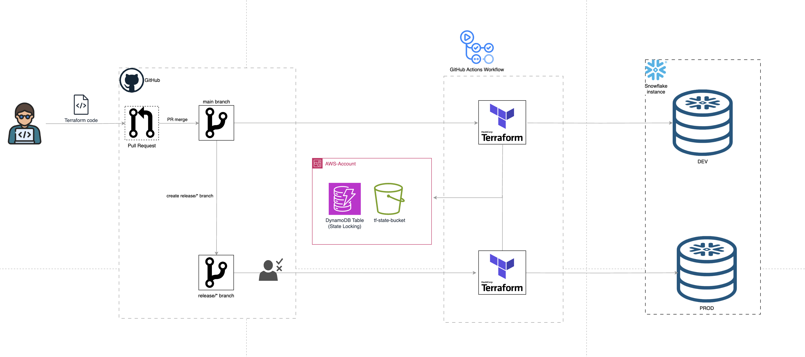

# cicd-with-terraform-for-snowflake
This is a repository to demo how to use Terraform and GitHub actions to create and deploy a sample DB, schema, table and grants on a Snowflake account.
A pull request from a feature branch to **main** branch will deploy to **DEV** Environment
Creating a **release/*** branch from **main** branch will initiate a deploy to **PROD** Environment.

